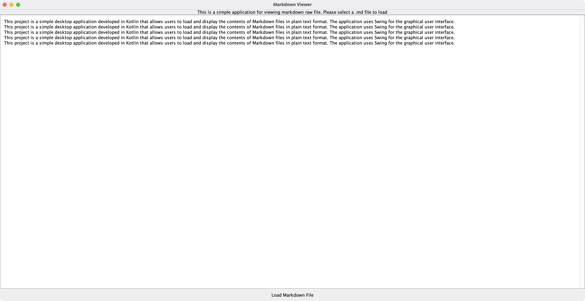

# Markdown Viewer
## Overview
This project is a simple desktop application developed in Kotlin that allows users to load and display the contents of Markdown files in plain text format. The application uses Swing for the graphical user interface.  
## Features

- Load a Markdown file from the local disk.
- Display the content of the file as plain text in a text area.
- Simple file type validation to load only files with the .md extension.
- Scrollable text area for viewing the content.
- User-friendly interface with a title and a load button.

## Usage
- Launch the application.
- Click the "Load Markdown File" button at the bottom.
- Select a .md file from your local disk.
- The content of the selected file will be displayed in the text area.

## screenshot
